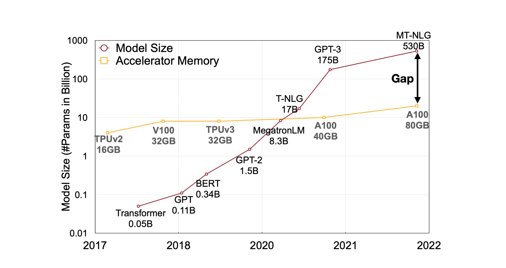
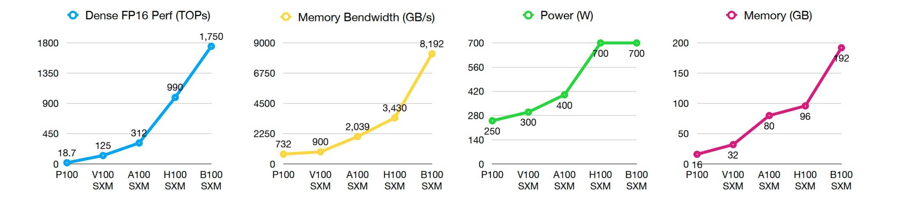
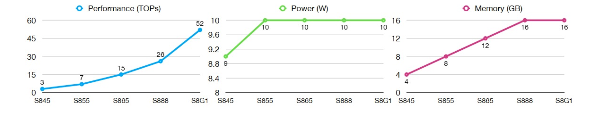

> 인공지능시스템, "AI Systems Metrics and Bottlenecks," CAS 3400, 2025.

## Model Outgrows Hardware

### 딥러닝 모델과 하드웨어

최근에는 모델의 크기가 GPU의 메모리보다 더 빠른 속도로 발전하고 있어서 메모리 용량의 수요와 공급 사이에 격차가 발생하고 있다.[^1] 그래서 이 격차를 해소하기 위해 모델 압축(model compression), 지식 증류(knowledge distillation)과 같은 다양한 방법들이 등장하게 되었다.

### 클라우드와 엣지

클라우드와 엣지의 하드웨어는 다소 다른 방향으로 발전해오고 있다. 클라우드 서버에서는 주로 NVIDIA를 사용하는데, NVIDIA의 머신들은 세대가 지날수록 TOPs(Tera Operations Per Second)와 메모리(GB) 및 메모리 대역폭(GB/s) 수치가 발전하고 있지만 이에 비례해서 전력 소모량(W)도 증가하고 있다. 그래서 거대 모델을 학습하는 데에는 여전히 많은 시간과 비용, 에너지가 소모된다.

하지만 엣지 디바이스 환경에서는 전력에 대한 제약 사항을 고려해야 한다. 엣지 디바이스들은 NVIDIA 머신들보다 훨씬 가볍고, 저전력 환경에서도 성능을 발휘하기 위해 설계된다. 퀄컴의 Hexagon DSP, 애플의 Apple Silicon 등이 있고 한정된 전력 소모량으로 TOPs를 개선하는 방향으로 발전하고 있다.

## Efficiency Metrics for AI Systems

### 레이턴시

레이턴시(latency)는 특정 태스크를 완수하는 데 걸리는 딜레이를 나타내며 학습, 추론 모두에 영향을 미친다. 프로세서와 메모리 모두에 영향을 받으며, 총 레이턴시 $\approx \max(T_{\text{computation}}, T_{\text{memory}})$로 간주할 수 있다.

- $T_{\text{computation}}$: 프로세서로 인한 병목. 모델의 연산 횟수가 많아질수록, 프로세스의 초당 연산 횟수가 적어질수록 커진다.
- $T_{\text{memory}}$: 메모리로 인한 병목. Activation과 weight 데이터가 많을수록, 메모리 대역폭이 좁을수록 커진다.

레이턴시는 일반적으로 $\frac{\text{모델 스펙}}{\text{하드웨어 성능}}$에 비례한다. 모델이 커질수록, 하드웨어 성능이 떨어질수록 레이턴시는 증가한다. 또한 모델 스펙과 하드웨어 스펙이 동일하더라도 데이터셋에 따라 레이턴시가 달라질 수 있다.

### 메모리 비용

메모리 비용에 영향을 주는 요인으로는 파라미터 갯수와 모델 크기, 그리고 activation이 있다.

**(1) 모델 크기**

모델의 크기는 가중치를 저장하기 위해 필요한 스토리지 크기를 나타낸다. 모든 파라미터가 동일한 데이터 타입으로 구성되어 있다면 크기는 `파라미터 갯수 * 비트 폭(bit width)`으로 측정할 수 있다. 예를 들어 32비트 부동소수점 50M개로 이루어진 모델의 크기는 200 MB가 된다. 양자화를 통해 비트 폭을 조정하여 모델의 크기를 절약할 수 있지만 성능이 저하될 수 있다.

**(2) Activations**

학습 단계의 주요 메모리 병목은 activation에서 발생한다. 추론 단계에서는 레이어 $l$의 출력값 $\mathbf{a}^{[l]}$을 계산할 때 직전 레이어의 출력값 $\mathbf{a}^{[l-1]}$만 있으면 되기 때문에 그보다 이전의 값들은 저장해 둘 필요가 없다. 하지만 학습 단계에서는 순전파에서 계산된 모든 레이어의 값들을 메모리에 기록해 두어야 이를 역전파에서 사용할 수 있다.

$$
\begin{align}
\frac{\partial L}{\partial \mathbf{W}^{[l]}} &= \frac{\partial L}{\partial \mathbf{z}^{[l]}} \times \frac{\partial \mathbf{z}^{[l]}}{\partial \mathbf{W}^{[l]}} \\ &= \frac{\partial L}{\partial \mathbf{a}^{[l]}} \times \frac{\partial \mathbf{a}^{[l]}}{\partial \mathbf{z}^{[l]}} \times \frac{\partial \mathbf{z}^{[l]}}{\partial \mathbf{W}^{[l]}} \\ &= \frac{\partial L}{\partial \mathbf{a}^{[l]}} \times \frac{\partial \mathbf{a}^{[l]}}{\partial \mathbf{z}^{[l]}} \times \mathbf{a}^{[l-1]}
\end{align}
$$

즉 레이어 $l$에서의 편미분을 계산하려면 $\mathbf{a}^{[l-1]}$ 값이 필요한데, 이 과정을 마지막 레이어부터 첫 번째 레이어까지 역순으로 진행하기 때문에 결국 모든 레이어의 출력값을 기억하고 있어야 한다.

또한 $\mathbf{a}^{[l]}$의 크기는 미니 배치의 크기에 따라 달라진다. 미니 배치의 크기가 $n$배 증가하면 $\mathbf{a}^{[l]}$의 크기도 $n$배로 증가하기 때문에 더 많은 메모리 공간을 필요로 하게 된다. 물론 엣지 디바이스에서는 배치 크기를 1로 설정하더라도 감당하기 어려운 경우가 많다.

반면 파라미터 갯수는 배치 크기에 영향을 받지 않는다. SGD든 BGD든 업데이트되는 파라미터의 갯수는 동일하다. 그렇기 때문에 일반적으로 activation이 파라미터 갯수보다 메모리 병목에 더 큰 영향을 미친다.

**(3) 기타**

이것 외에도 배치 정규화, 데이터셋 로딩, 변수 선언 등 메모리 비용에 영향을 주는 다양한 요인들이 있다.

### 계산 비용

**(1) MAC 연산**

$$
a \leftarrow a + b \cdot c
$$

MAC(Multiply-Accumulate) 연산은 두 값의 곱을 누적하는 연산이다. 신경망의 각 레이어에서 모든 뉴런들의 출력 값들을 계산하는 데에 쓰인다. FC 레이어의 순전파도 단순한 MAC 연산($\sum w_i x_i$)일 뿐이다.

**(2) FLOP 연산**

FLOP(Floating Point Operation) 연산은 부동소수점에서 수행되는 사칙연산을 지칭한다. 1번의 MAC은 곱셈 1회(1 FLOP)와 덧셈 1회(1 FLOP)으로 이루어져 있기 때문에 총 2 FLOPs가 된다. 프로세서의 성능을 나타내기 위해 초당 부동소수점 연산 횟수인 FLOPS(FLOPs per second)를 사용하기도 한다.

[^1]: G. Xiao, J. Lin, M. Seznec, H. Wu, J. Demouth, and S. Han, “SmoothQuant: Accurate and Efficient Post-Training Quantization for Large Language Models,” *ICML*, 2023.