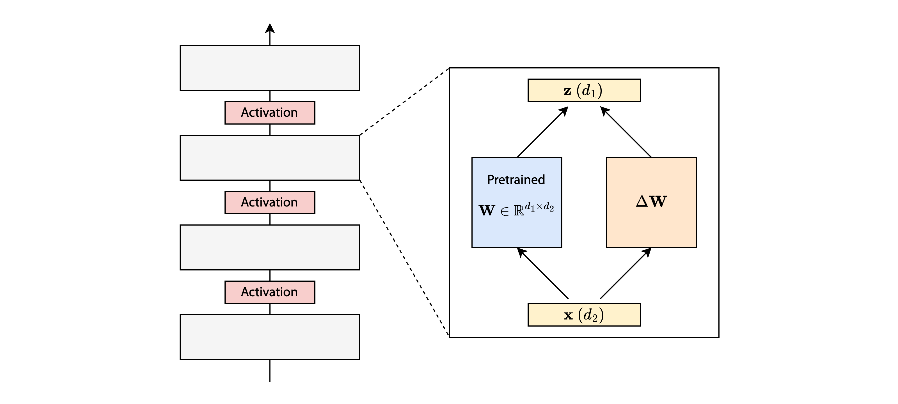
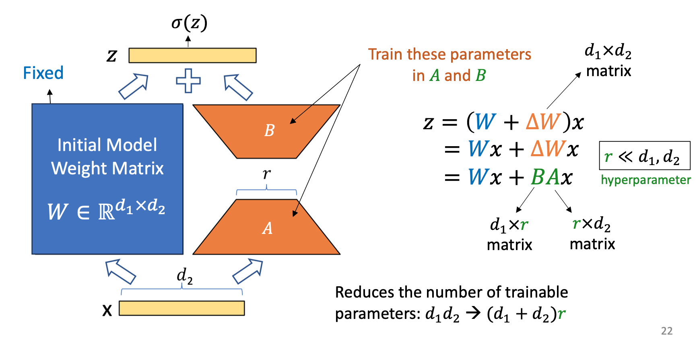
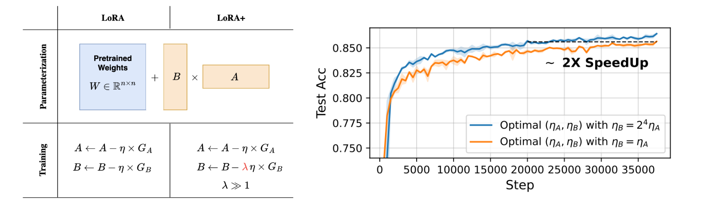
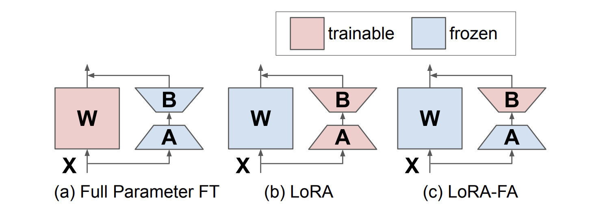
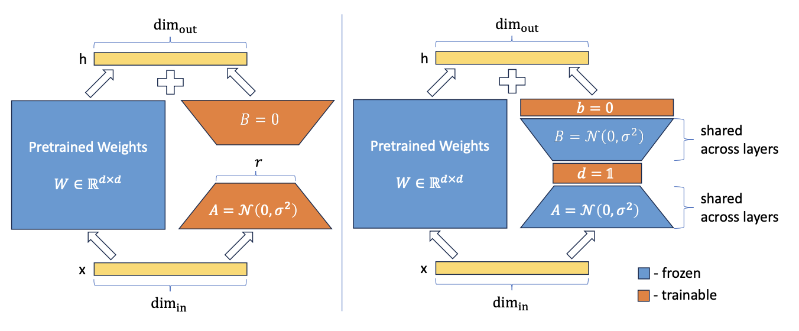

> 인공지능시스템, "Efficient On-Device Training - Part 1," CAS 3400, 2025.

## Low Rank Adaptation

### 메모리 병목 현상 완화하기

학습 단계의 [[AI 시스템의 지표와 병목|주요 병목]]에는 (1) 역전파 행렬 계산에서의 FLOP 수, (2) 파라미터와 관련된 메모리 비용, (3) activation과 관련된 메모리 비용이 있다. **LoRA**(Low Rank Adaptation)는 학습에 사용되는 파라미터 수(2)를 줄이고 이를 통해 FLOP 수(1)까지 줄일 수 있는 방법으로 최근 LLM 학습에 널리 사용되고 있다.

### 하이레벨 아이디어

$$
\mathbf{W}' = \mathbf{W} + \Delta\mathbf{W}
$$

특정 레이어의 가중치를 $\mathbf{W}$라고 하자. 모델을 학습시킨다는 것은 초기 가중치 $\mathbf{W}$를 타겟 태스크에 맞게 $\mathbf{W}'$으로 업데이트 하는 것이다. LoRA는 이 과정을 $\Delta \mathbf{W}$의 관점에서 접근하는 것에서 시작한다. 초기 가중치 $\mathbf{W}$는 그대로 freeze한 상태에서 학습 과정에서 누적된 $\Delta \mathbf{W}$를 더해서 최종적으로 $\mathbf{W}'$을 얻는다. 즉 학습을 $\Delta \mathbf{W}$를 얻기 위한 과정으로 생각하는 것이다.

$$
\Delta \mathbf{W} = \mathbf{B} \mathbf{A}
$$

여기서 LoRA의 핵심 아이디어는 $\Delta \mathbf{W}$를 두 행렬 $\mathbf{A}$와 $\mathbf{B}$의 곱으로 분해(low-rank decomposition)하는 것이다. 이렇게 되면 학습 가능한 파라미터의 갯수를 $d_1d_2$에서 $r(d_1 + d_2)$로 줄일 수 있다. 그리고 이런 작업을 모델의 일부 혹은 전체 레이어에 적용함으로써 비용을 절약한다. 여기서 $r$이 작을수록 학습 파라미터의 갯수를 많이 줄일 수 있지만 퍼포먼스가 떨어질 수 있기 때문에 적절한 값으로 조절해야 한다.

이러한 방식의 분해는 원래 행렬의 랭크가 낮을 때(non-full-rank)에만 가능하다. 가중치 행렬 $\mathbf{W}$가 full rank가 아니라는 이론적인 보장은 없지만, 신경망의 고차원 행렬들은 일반적으로 낮은 랭크를 가지고 있기 때문에 적용해도 무리가 없다.[^1]

## Implementation of LoRA

### 학습

사전 학습된 $\mathbf{W}$를 기반으로 $\mathbf{A}, \mathbf{B}$를 초기화한다. $\mathbf{W}$에 대한 정보 없이 바로 학습을 진행해도 되지만 잘 학습된 가중치를 시작점으로 설정하는게 일반적으로 더 좋은 성능을 보여준다. 그리고 아래의 단계를 여러 epoch으로 반복한다.

1. $\mathbf{W}, \mathbf{B}, \mathbf{A}$를 사용하여 순전파를 계산한다.
   
$$
\begin{align}
\mathbf{z} &= \mathbf{(W + BA)x} \\
\mathbf{y} &= \sigma(\mathbf{z})
\end{align}
$$
  
2. 역전파를 계산하고 $\frac{\partial L}{\partial \mathbf{A}}$와 $\frac{\partial L}{\partial \mathbf{B}}$를 계산한다.
   
$$
\begin{align}
\frac{\partial L}{\partial \mathbf{A}} &= \frac{\partial L}{\partial \mathbf{z}} \frac{\partial \mathbf{z}}{\partial \mathbf{A}} = \frac{\partial L}{\partial \mathbf{y}} \frac{\partial \mathbf{y}}{\partial \mathbf{z}} \frac{\partial \mathbf{z}}{\partial \mathbf{A}} \\
\frac{\partial L}{\partial \mathbf{B}} &= \frac{\partial L}{\partial \mathbf{z}} \frac{\partial \mathbf{z}}{\partial \mathbf{B}} = \frac{\partial L}{\partial \mathbf{y}} \frac{\partial \mathbf{y}}{\partial \mathbf{z}} \frac{\partial \mathbf{z}}{\partial \mathbf{B}}
\end{align}
$$

3. $\mathbf{A}$와 $\mathbf{B}$를 업데이트한다.
   
$$
\begin{align}
\mathbf{A} & \leftarrow \mathbf{A} - \eta \frac{\partial L}{\partial \mathbf{A}} \\
\mathbf{B} & \leftarrow \mathbf{B} - \eta \frac{\partial L}{\partial \mathbf{B}}
\end{align}
$$

$\mathbf{W, B, A}$가 분리되어 있기 때문에 순전파에서 필요한 메모리는 다소 증가할 수 있다. 하지만 역전파에서 필요한 메모리는 확실하게 줄일 수 있기에 ($d_1d_2$에서 $r(d_1 + d_2)$) 궁극적으로 총 메모리 사용량을 크게 줄일 수 있다.

### 추론

LoRA에서는 추가적인 레이턴시가 발생하지 않는다. $\mathbf{Wx}$와 $\mathbf{B^*A^*x}$를 따로 계산할 필요 없이 한번에 $\mathbf{(W + B^*A^*)x}$로 계산할 수 있기 때문이다. $\mathbf{W}$와 $\mathbf{A, B}$는 학습 단계에서만 분리하면 된다. 

## Efficiency Analysis

### 스토리지

LoRA의 방식은 다운스트림 태스크가 여러 개일때 가중치들을 저장하기 위해 필요한 스토리지의 크기를 줄여준다. $K$개의 태스크에 대해 학습된 가중치들을 저장할 때 $\{\mathbf{W}_i\}_{i=1}^K$를 전부 저장할 필요 없이, 초기 가중치 $\mathbf{W}$와 각 태스크에 해당하는 어댑터 $\{\mathbf{A}_i\}_{i=1}^K, \{\mathbf{B}_i\}_{i=1}^K$만 저장하면 되기 때문이다.

### 메모리 비용

**(1) 파라미터 메모리**

학습 과정에서 파라미터 메모리 비용을 줄일 수 있다. 가중치 $\mathbf{W} \in \mathbb{R}^{d_1 \times d_2}$를 Adam으로 학습시킨다고 하면, 가중치에 대한 메모리 $d_1d_2$ + 기울기에 대한 메모리 $d_1d_2$ + 1차/2차 모멘텀에 대한 메모리 $2d_1d_2$ = 총 $4d_1d_2$의 메모리가 필요하게 된다.

반면 LoRA에서는 학습 가능한 파라미터의 갯수가 $r(d_1 + d_2)$개 뿐이기 때문에 필요한 메모리는 기존 가중치($\mathbf{W}$)에 대한 메모리 $d_1d_2$ + LoRA 가중치($\mathbf{A, B}$)에 대한 메모리 $r(d_1 + d_2)$ + 기울기에 대한 메모리 $r(d_1 + d_2)$ + 1차/2차 모멘텀에 대한 메모리 $2r(d_1 + d_2)$로 총 $d_1d_2 + 4r(d_1 + d_2)$만큼만 필요하게 된다.

||기존|LoRA|
|-|-|-|
|모델 가중치|$d_1d_2$|$d_1d_2 + r(d_1 + d_2)$|
|기울기|$d_1d_2$|$r(d_1 + d_2)$|
|모멘텀|$2d_1d_2$|$2r(d_1 + d_2)$|
|계|$4d_1d_2$|$d_1d_2 + 4r(d_1 + d_2)$|

**(2) Activation 메모리 (역전파 캐시)**

$\frac{\partial \mathbf{z}}{\partial \mathbf{A}}$와 $\frac{\partial \mathbf{z}}{\partial \mathbf{B}}$를 각각 저장해야 하므로 역전파를 위해 캐싱해야 하는 출력값들은 $d_2 \times n$에서 $(r + d_2) \times n$으로 늘어나게 된다. 따라서 배치 크기가 늘어날수록 필요한 메모리도 비례해서 증가하게 된다.

### 계산 비용

학습 가능한 파라미터의 갯수를 줄임으로써 역전파에서의 총 FLOP을 줄일 수 있다.

## Variants of LoRA

### LoRA+

LoRA는 $\mathbf{A}$와 $\mathbf{B}$에 동일한 학습률을 적용한다. 하지만 LoRA+의 저자들은 규모가 큰 모델에서 이러한 세팅이 왜 최적이 아닌 지(suboptimal) 증명하고 이를 해결하기 위해 각각 다른 학습률을 적용하는 방법을 제시한다. 해당 연구에서는 $A$의 학습률을 $\eta$, $B$의 학습률을 $\lambda \eta$ ($\lambda \gg 1$)로 설정하였고, 이를 통해 computational cost는 그대로 유지하면서 학습(fine-tuning) 속도를 2배 이상 단축하고 퍼포먼스도 1~2% 향상시킬 수 있었다.[^2]

### LoRA-FA

$\mathbf{A}$와 $\mathbf{B}$의 activation을 별도로 저장해야 한다는 점은 LoRA의 한계점 중 하나이다. LoRA-FA (Frozen A)는 $\mathbf{A}$를 랜덤 값으로 초기화 및 고정하고, $\mathbf{B}$만 업데이트 하는 방법을 제시한다. 이러한 방식을 사용하면 파라미터 메모리와 activation 메모리를 동시에 줄일 수 있다.

||LoRA|LoRA-FA|
|-|-|-|
|파라미터|$d_1d_2 + 4r(d_1 + d_2)$|$d_1d_2 + 4rd_1 + \alpha$|
|Activation|$(d_2 + r) \times n$|$r \times n$|

물론 $\mathbf{A}$를 고정하면 약간의 성능 저하는 불가피하다. 하지만 LoRA-FA의 의의는 LoRA에 비해 메모리 비용을 1.4배[^3] 줄이면서 동시에 일부 태스크에서는 LoRA와 견주어 볼만한 퍼포먼스를 보여주는 데에 있다.

### VeRA

$$
\Delta \mathbf{W} = \Lambda_p \mathbf{B} \Lambda_q \mathbf{A}
$$

VeRA는 $\mathbf{A, B}$로부터 학습 가능한 파라미터를 더 감축하는 방법을 제시한다. $\mathbf{A}$와 $\mathbf{B}$를 모두 랜덤 초기화 값으로 고정시킨다. 대신 $\mathbf{A, B}$에 각각 대각 행렬 $\Lambda_q, \Lambda_p$를 곱해주는데, 이 대각 행렬들의 성분들만 학습을 시켜주는 것이다. 따라서 학습 가능한 파라미터의 갯수는 총 $r + d_1$개가 된다. 저자들은 이러한 방식으로도 만족할만한 성능을 달성할 수 있음을 제시하였다.

### NoLA

LoRA는 모델 아키텍처와 $r$에 따라 여전히 많은 수의 파라미터를 학습해야 하는 경우가 있다. NoLA는 ICCV' 23의 PRANC[^4]로부터 아이디어를 차용하여 이를 해결하고자 하였다. PRANC는 모델이 랜덤하게 초기화된 신경망 여러 개의 선형 조합($\theta = \sum \alpha_i \hat{\theta_i}$)으로 재구성될 수 있다는 결론을 제시한다. 모델을 학습시킬 때에도 $\hat{\theta_i}$는 랜덤하게 초기화 및 고정하고, $\sum \alpha_i \hat{\theta_i}$의 계수 $\alpha_i$만 학습을 시키게 된다.

NoLA는 이러한 방식을 $\mathbf{A, B}$에 각각 적용한다. $\mathbf{A} = \sum \alpha_i \mathbf{A}_i$, $\mathbf{B} = \sum \beta_j \mathbf{B}_j$로 표현하고 $\alpha_i, \beta_j$만 학습을 시키는 것이다. 이를 적용하면 모델 아키텍처와 $r$ 값에 무관하게 항상 일정한 수의 파라미터만 학습시킬 수 있게 된다.

[^1]: 인공지능시스템, "Week 4 Efficient On-Device Training -- Part 1," CAS 3400, 2025. pp. 40
[^2]: Hayou et al., “LoRA+: Efficient Low Rank Adaptation of Large Models,” ICML, 2024.
[^3]: Zhang et al., “LoRA-FA: Memory-efficient Low-rank Adaptation for Large Language Models Fine-tuning,” arXiv, 2023.
[^4]: Nooralinejad et al., “ PRANC: Pseudo Random Networks for Compacting deep models,” ICCV, 2023.