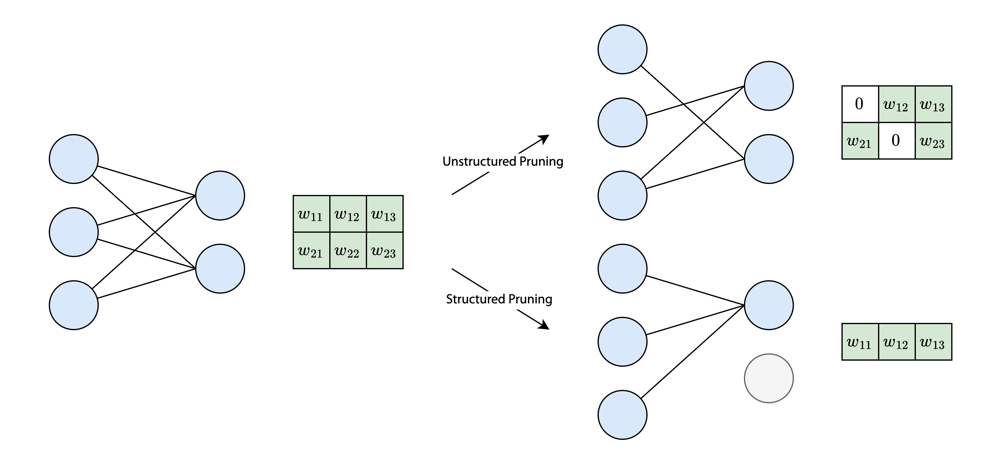
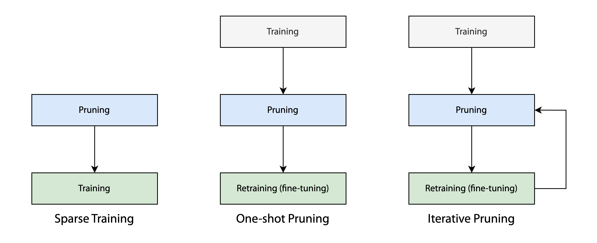
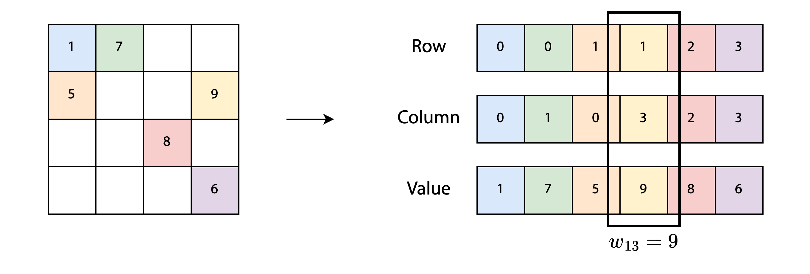
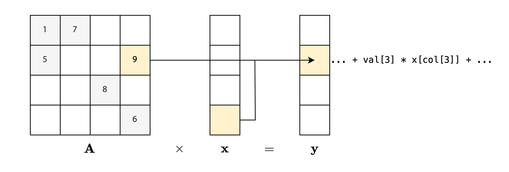
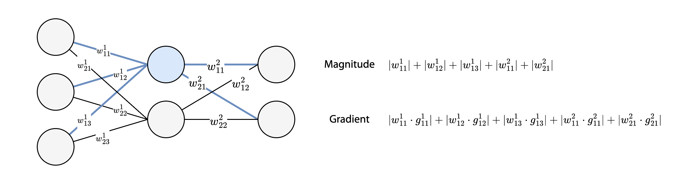

> 인공지능시스템, "Week 10. Model Sparsification," CAS 3400, 2025.[^1]

## Model Pruning

[[LoRA]]나 연합 학습과 같은 기법들은 모델의 학습 과정에서 발생하는 비용을 줄여주지만 학습이 끝난 최종 모델의 크기를 줄여주지는 않기 때문에 추론 단계에서 발생하는 연산, 스토리지 비용과 레이턴시를 줄이지 못한다. 추론 단계에서 발생하는 다양한 비용들을 줄이기 위한 방법 중 하나로 **가지치기**(pruning)가 있다. 가지치기는 학습 전후 단계에서 모델의 파라미터 중 일부를 제거하는 방식으로, 정확도를 최대한 유지하면서 모델을 경량화하는 것을 목표로 한다.



가지치기에는 크게 두 가지 방식이 있다. 하나는 신경망 그래프에서 간선(edge)를 제거하는 **Unstructured Pruning** 방식이다. 간선의 제거는 가중치 행렬 $\mathbf{w}$의 특정 값 $w_{i, j}$를 0으로 설정하는 방식으로 이루어진다. 따라서 가중치 행렬의 크기 자체는 달라지지 않지만 기존에 비해 **희소한(sparse) 그래프**를 얻을 수 있으며, 상대적으로 뛰어난 정확도를 유지할 수 있다.

또다른 방식은 그래프의 정점(node)를 제거하는 **Structured Pruning** 방식이다. 그래프에서 정점을 제거하면 그 정점과 연결된 모든 간선들은 함께 제거되기 때문에, 정점을 제거하면 가중치 행렬에서 특정 행이나 열 전체가 사라지게 된다. 이로 인해 가중치 행렬의 크기가 줄어들게 되고, 가지치기의 결과로 **밀집된(dense) 작은 그래프**를 얻을 수 있다. 하지만 모델의 아키텍처 자체가 달라지기 때문에 정확도 측면에서의 손해를 감수해야 한다.

## Unstructured Pruning

### 제거할 가중치(간선) 선택

**(1) 크기(magnitude) 기반 가지치기**

크기($|w_i|$)가 작은 파라미터는 출력값을 계산하는 과정에서 미치는 영향이 미미할 것이라는 아이디어에 기반한다. 행렬의 원소들을 크기 순으로 나열했을 때 가장 작은 값들을 일정 비율만큼 제거한다.

**(2) 기울기(gradient) 기반 가지치기**

기울기($|w_i \cdot g_i|$)의 크기가 작은, 즉 학습 과정에서 변화량이 작은 파라미터들을 제거하는 방식이다. 어떤 파라미터의 기울기 값이 작다면 손실 함수에서 해당 파라미터가 가지는 영향력이 작다는 뜻이고, 이는 현재 데이터셋을 학습하는 데에 있어서 중요도가 떨어진다는 것을 의미하기 때문이다.

가중치 $\mathbf{w}$에서 가지치기로 인한 가중치 변화를 $\mathbf{u}$라고 하자. 이 때 $\mathbf{u}$에 따른 손실 함수 $L$의 변화량은 테일러 급수로 다음과 같이 근사시킬 수 있다.

$$
L(\mathbf{w}) \approx L(\mathbf{w + u}) + g^T \cdot \mathbf{u}
$$

여기서 제거하기로 결정한 가중치가 $w_i$라면 $\mathbf{u} = -w_ie_i$로 나타낼 수 있고, 아래와 같이 정리할 수 있다.

$$
|L(\mathbf{w}) - L(\mathbf{w} - w_ie_i)| = |g^T \cdot w_ie_i| = |g_i \cdot w_i|
$$

즉 $|w_i \cdot g_i|$ 값이 작다면 $w_i$를 제거함으로써 생기는 손실 함수의 변화량이 작고, 이는 해당 가중치가 내부에서 갖는 영향력이 미미하다는 것을 의미하기에 제거 대상으로 적절하다고 할 수 있다.

**(3) 헤시안(Hessian) 기반 가지치기**

헤시안을 기준으로 제거할 가중치를 선택할 수도 있다. 잘 학습된 모델에서는 대부분의 $g$ 값이 0에 가깝기 때문에 적절한 기준이 되지 못할 수 있기 때문이다. $\mathbf{u}$에 따른 $L$의 변화량을 이차 테일러 급수로 아래와 같이 표현할 수 있다.

$$
\begin{align}
L(\mathbf{w+u}) &\approx L(\mathbf{w}) + g^T \cdot \mathbf{u} + \frac{\mathbf{u}^T\mathbf{H}\mathbf{u}}{2} \\
&\approx L(\mathbf{w}) + \frac{\mathbf{u}^T\mathbf{H}\mathbf{u}}{2} \\
&\approx L(\mathbf{w}) + \frac{|w_i|^2H_{ii}}{2}
\end{align}
$$

따라서 $\frac{|w_i|^2H_{ii}}{2}$ 값이 작은 $w_i$를 선택해서 제거할 수 있다. 원래 헤시안 행렬은 $O(N^2)$의 공간 복잡도를 요구하지만 가지치기에선 대각 성분 $H_{ii}$만 필요로 하기 때문에 $O(N)$까지 공간 복잡도를 줄일 수 있다.

### 가지치기 수행 방식



**(1) 학습 전 가지치기(sparse training)**

학습을 시작하기 전에 미리 가중치를 제거하고 학습을 진행하는 방식으로, 학습 단계에 소요되는 시간과 비용을 절약할 수 있다는 장점이 있다. 하지만 가중치의 크기, 기울기, 헤시안 등 제거할 가중치에 대한 정보가 불완전하기 때문에 성능이 매우 불안정하다.

**(2) 학습 후 가지치기(one-shot)**

일차적으로 모델을 사전학습 시킨 후 크기, 기울기, 헤시안을 활용하여 가지치기를 수행한다. 가지치기 이후 재학습(혹은 fine-tuning)을 진행하여 정확도를 다듬는 작업을 수행한다.

**(3) 반복적 가지치기(iterative)**

재학습과 가지치기를 수 차례 반복하는 방식이다. 초기에는 적은 비율의 가중치만 제거하고, 재학습을 거듭하면서 점차적으로 제거 비율을 높여나가는 과정을 거친다. 가중치를 점차적으로 제거하기 때문에 가장 뛰어난 정확도를 보이지만 기존의 학습 방식보다 최대 2배~10배까지 더 많은 학습량을 요구한다는 단점이 있다.

### 가중치가 제거된 희소 행렬을 효율적으로 활용하기

Unstructured Pruning 방식에서 행렬의 크기 자체는 변하지 않는다. 그래서 가지치기를 통해 일부 가중치를 0으로 설정하더라도 일반적인 방식으로는 연산 횟수나 메모리를 최적화할 수 없다. 따라서 희소 행렬에서 0이 아닌 값들만 효율적으로 저장하고 계산하기 위한 특별한 방식이 필요한데, 대표적인 기법 중 하나가 **COO(Coordinate List)** 포맷이다.



COO 포맷에서 2차원 행렬은 행 위치 배열, 열 위치 배열, 값 배열의 조합으로 표현된다. 행렬의 원소 $w_{ij}$에 대해 행 위치 배열에는 $i$, 열 위치 배열에는 $j$, 값 배열에는 $w_{ij}$가 저장된다. 이때 $w_{ij} = 0$인 원소는 포함하지 않는다. 따라서 행렬에서 $w_{ij} \neq 0$인 원소의 개수를 $K$라고 하면 $k \lt K$에 대해 `w[row[k]][col[k]] = val[k]`로 표현된다. 

COO 포맷에서는 다음과 같은 방식으로 행렬의 곱셈 $\mathbf{Ax = y}$에서의 연산 횟수를 최적화한다.



```python
y = [0, 0, ..., 0]
for i in range(K):
    y[row[i]] += val[i] * x[col[i]]
```

이를 통해 곱셈 연산의 시간 복잡도를 $O(N)$에서 $O(K)$로 줄일 수 있다. 또한 공간 복잡도는 $O(N)$에서 $O(3K)$가 되기 때문에 희소한 행렬($K \ll N$)일수록 공간 복잡도 측면에서도 이점이 생기게 된다.

COO 외에도 희소 행렬을 표현하는 다양한 방법이 있다. CUDA의 cuSPARSE는 **CSR(Compressed sparse-row)** 포맷을 사용하는데, CSR은 COO의 행 위치 배열을 압축하여 더욱 최적화한 방식이다. COO의 행 위치 배열은 `[0, 0, 1, 1, 2, 3]`처럼 반복적인 행 번호가 순차적으로 등장하는데, 이러한 반복적인 값을 없애기 위해 행 위치 배열에서 각 번호의 첫 인덱스를 배열로 표현한다. 가령 `[0, 0, 1, 1, 2, 3]`은 CSR에서 `[0, 2, 4, 5, 6]`으로 표현할 수 있다. 마지막 원소(`6`)는 $K$를 나타내는데 행 번호를 변환할 때 종료 지점을 나타내기 위해 포함한다. 반대로 열 위치 배열을 압축하는 CSC 포맷도 있다.

## Structured Pruning

### 제거할 뉴런(노드) 선택



Unstructured Pruning에서는 가중치의 중요도(크기, 기울기, 헤시안)를 기준으로 제거할 가중치를 선택했었던 것과 유사하게, Structured Pruning에서는 **뉴런과 연결된 모든 가중치의 중요도 합**을 기준으로 제거할 뉴런을 선택한다.

### 가지치기 수행 방식

마찬가지로 학습 전에 뉴런을 제거하는 방식, 사전학습 후 뉴런을 제거하는 방식, 반복적으로 뉴런을 제거하고 재학습하는 방식이 있다.

### 계산 구현

Unstructured Pruning과 다르게 Structured Pruning에서는 가지치기 후 가중치 행렬의 크기 자체가 줄어들기 때문에 특별한 기법 없이 단순한 방식으로도 연산 횟수를 줄일 수 있다.

[^1]: 인공지능시스템, "Week 10. Model Sparsification -- Part 1," CAS 3400, 2025. pp. 40