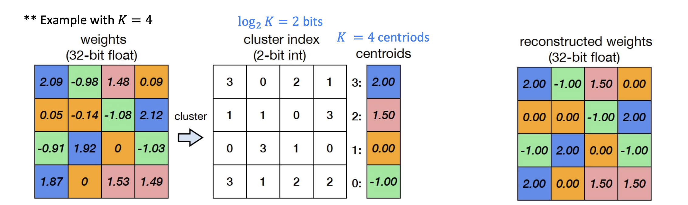
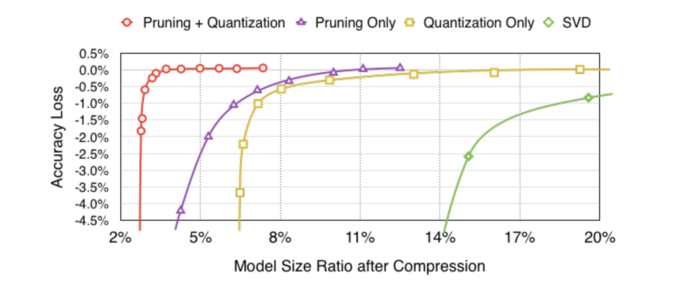

> 인공지능시스템, "Week 11. Model Quantization," CAS 3400, 2025.[^1]

## Model Quantization

양자화(quantization)는 가중치와 activation을 낮은 정밀도를 갖는 데이터 타입으로 변환하여 추론 시 발생하는 메모리와 연산 비용을 줄여주는 기법이다. [[가지치기(Pruning)를 통한 모델 경량화|가지치기]]가 모델의 파라미터 개수를 줄여서 효율성을 개선했다면 양자화는 파라미터 하나의 크기를 줄여서 효율성을 개선하는 방식이다. 양자화를 통해 일반적으로 사용하는 32비트 부동 소수점(`float32`)을 16비트 부동 소수점(`float16`) 혹은 8비트 정수(`int8`)로 변환하여 모델의 크기를 줄일 수 있고 하드웨어에 따라 연산 상의 이점도 얻을 수 있다.

양자화 적용 과정은 크게 *학습(training time) - 양자화(quantization time) - 런타임(runtime)* 의 3단계로 나눌 수 있다. 학습이 완료되면 모델의 가중치를 낮은 정밀도의 데이터 타입으로 양자화하여 저장하고, 런타임에 입력값이 들어오면 양자화된 가중치를 사용하여 빠른 연산을 수행하게 된다.

## Quantization Methods

양자화를 하려면 대상 값의 범위를 알아야 한다. 예를 들어 32비트 부동 소수점을 8비트 정수로 변환한다고 하자. `float32`는 `int8`에 비해 값의 표현 범위가 넓고 간격도 다르기 때문에 이 둘 사이를 매핑할 방법이 있어야 한다. 따라서 `int8`로 clipping할 `float32` 값의 범위를 $[\alpha, \beta]$로 한정하고, 이 범위의 값을 `int8`의 범위로 투사시킬 최선의 방법을 찾아야 한다.

가중치는 학습이 완료된 시점에 값이 고정되기 때문에 clipping range를 쉽게 정할 수 있다. 하지만 activation은 런타임 입력값에 따라 유동적으로 범위가 달라지기 때문에 양자화 시점(quantization time)에 clipping range를 결정하는 데에 어려움이 따른다. 따라서 양자화는 activation의 clipping range를 결정하는 시점에 따라 3가지로 구분할 수 있다.[^2]

### Post-Training Dynamic Quantization

*런타임(runtime)* 에 activation의 clipping range를 결정하는 방식이다. 입력값이 들어오면 각 activation이 계산되는 시점에 $[\alpha, \beta]$를 결정, 이를 기반으로 양자화를 수행한다(on-the-fly). 큰 어려움 없이 좋은 성능을 보이지만 매번 범위를 계산해야 하기 때문에 추가적인 계산 비용이 발생한다.[^3]

### Post-Training Static Quantization

*양자화 시점(quantization time)* 에 clipping range를 결정하는 방식이다. 학습이 완료되고 난 이후에 데이터셋을 대표할 수 있는 샘플 몇 개를 모델에 통과시키면서 activation 값들을 관찰하고, 관찰된 값들을 기반으로 범위를 결정한다.

### Quantization-Aware Training

*학습 시점(training time)* 에 activation의 범위가 계산된다. QAT는 학습 시점에 양자화를 시뮬레이션하여 학습 이후 양자화로 인해 발생하는 오류를 최소화하고자 한다. 그래서 forward pass를 $\mathbf{z} = \mathbf{Wa}$ 대신 $\mathbf{z} = Q(\mathbf{W})\mathbf{a}$로 수행한다. 하지만 실제로 양자화된 정수값을 사용하진 않고 `float32`로 다시 변환된 "가짜 양자화" 값을 사용한다. 또한 $Q$는 미분 불가능한 함수기 때문에 역전파 단계에서 STE(straight-through-estimator)를 기반으로 그래디언트를 계산한다.

이후 QAT를 적용하여 학습된 모델을 양자화하면 QAT를 적용하지 않은 모델보다 좋은 성능을 보이게 된다.

## Post-Training Weight Quantization

### Linear Quantization

학습이 완료된 모델의 가중치를 양자화하는 가장 대표적인 방법은 **Linear(Affine) Quantization**이다. Shift & Scale을 통해 $[W_{\min}, W_{\max}]$의 가중치를 $[q_{\min}, q_{\max}]$로 매핑한다. 원래 값을 $W$, 양자화된 값을 $q$라고 했을 때 아래와 같은 식을 세운다.

$$
\begin{align}
q &= \text{round}(\frac{W}{S} + Z) \\
W &\approx (q - Z) \cdot S
\end{align}
$$

이때 $(q - Z) \cdot S$가 원래 값 $W$에 가장 근접해질 수 있도록 하는 $S, Z$ 값을 찾는 것이 관건이 된다. 따라서 $S$와 $Z$를 각각 아래와 같이 설정한다.

$$\begin{align}
S &= \frac{W_{\max} - W_{\min}}{q_{\max} - q_{\min}} \\
Z &= \text{round}(q_{\min} - \frac{W_{\min}}{S})
\end{align}
$$

이런 방식으로 부동 소수점을 정수 범위로 표현하여 정수 연산이 소수점 연산에 비해 가지는 이점을 활용할 수 있다.

### K-Means Quantization

가중치 행렬의 값들을 $K$개의 그룹으로 군집화하여 부동 소수점 가중치 값을 해당 값이 속한 클러스터의 정수 인덱스($\in [0, K - 1]$)로 표현하는 방식이다. 양자화된 가중치 행렬은 $K$ 미만의 정수 값을 표현하기 때문에 각 데이터는 $\log K$ 비트의 데이터로 표현될 수 있다.


위 예시에서 K-Means 양자화를 통해 총 스토리지 크기를 $32M$에서 $MN + 32 \cdot 2^N$로 줄일 수 있다. 앞서 언급한 양자화 방식과는 다르게 실제 가중치 값을 정수로 변환하지는 않기 때문에 연산 상의 이점은 없지만 모델의 크기 자체를 크게 줄일 수 있다.

모델 압축률 대비 성능은 가지치기가 K-Means 양자화보다 뛰어나지만 이 둘이 결합되면 강력한 효과를 나타낸다.[^4]

[^1]: 인공지능시스템, "Week 11. Model Quantization," CAS 3400, 2025.
[^2]: [“Quantization,” huggingface.co.](https://huggingface.co/docs/optimum/concept_guides/quantization)
[^3]: ["딥러닝의 Quantization (양자화)와 Quantization Aware Training," gaussian37.](https://gaussian37.github.io/dl-concept-quantization/#quantization-mapping-%EC%9D%B4%EB%9E%80-1)
[^4]: S. Han, H. Mao, and W. Dally, "Deep Compression: Compressing Deep Neural Networks With Pruning, Trained Quantization And Huffman Coding," ICLR 2016.