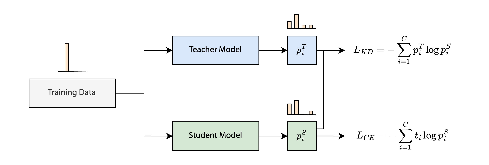
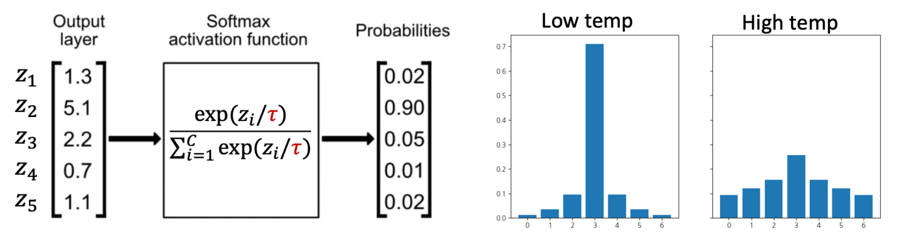
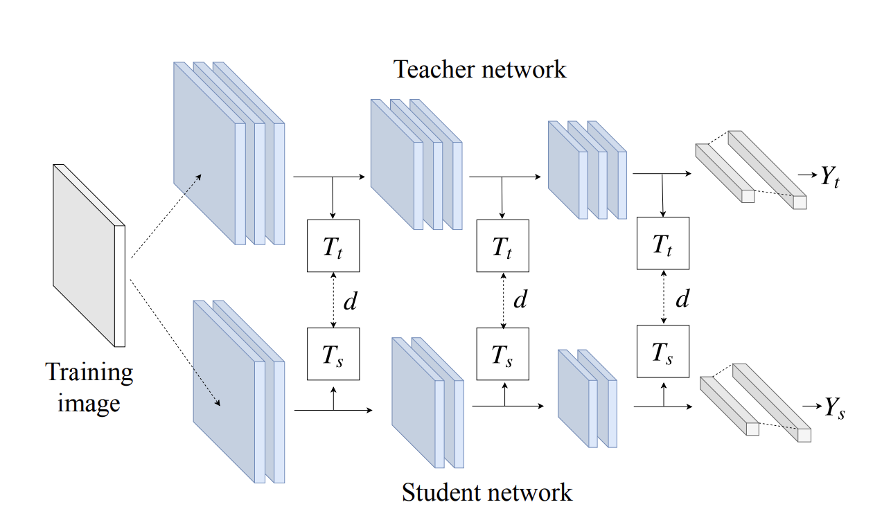

> 인공지능시스템, "Week 12. Knowledge Distillation," CAS 3400, 2025.[^1]

## Knowledge Distillation

[[가지치기(Pruning)를 통한 모델 경량화|가지치기]]와 [[양자화(Quantization)를 통한 모델 경량화|양자화]]는 기존에 학습시킨 모델에 직접 변경사항을 가하여 경량화된 모델을 얻는다. 반면 지식 증류(knowledge distillation)는 모델을 변경하는 대신 원래 모델을 기반으로 크기가 작은 모델을 완전히 새롭게 만드는 방식이다. 따라서 지식 증류는 효율적인 추론을 위한 또다른 학습 과정의 도입이라고 할 수 있다. 이때 원래의 대규모 모델을 **Teacher Model**, 새로 학습시킨 작은 모델을 **Student Model**이라고 한다. Student 모델은 학습 과정에서 기존의 데이터셋과 더불어 Teacher 모델의 "지식"을 활용한다.

## Distillation Losses

### Logit Distillation

기존 데이터셋의 라벨 대신 Teacher 모델의 로짓을 학습하는 방식이다. 단순히 Teacher 모델의 정답을 학습하는 게 아니라 Teacher 모델의 불확실성도 같이 학습하게 된다. 하지만 Teacher 모델이 항상 완벽한 예측을 하는 것은 아니기 때문에 데이터셋의 정답 라벨에 대한 학습도 병행해야 한다. 따라서 Student 모델의 loss는 정답 라벨에 대한 CE loss($L_{CE}$)와 Teacher 모델의 로짓에 대한 CE loss($L_{KD}$)의 결합으로 이루어진다.

$$
\begin{align}
L &= L_{CE} + \lambda \cdot L_{KD} \\
&= -\displaystyle\sum_{i=1}^C t_i \log p_i^S - \lambda \cdot \displaystyle\sum_{i=1}^C p_i^T \log p_i^S
\end{align}
$$

$L_{CE}$는 Student의 $p^S$가 정답 라벨 $t$에 가까워지도록 학습시키는 역할을 하고, $L_{KD}$는 Teacher의 $p^T$에 가까워지도록 학습시키는 역할을 한다.

여기서 Teacher 모델의 지식을 효과적으로 활용하기 위해 소프트맥스에 온도(temperature, $\tau$)를 설정한다. 소프트맥스 값은 $\tau$가 작을수록 원핫 인코딩에 가까워지고 클수록 uniform 분포에 가까워진다. 만약 $L_{KD}$의 $p_i^S, p_i^T$에 낮은 온도를 설정하면 분포가 원핫 인코딩에 가까워지기 때문에 Student 입장에서는 정답 라벨을 학습하는 것과 큰 차이가 없게 된다. 따라서 $L_{KD}$의 $p_i^S, p_i^T$에 대해서는 $\tau \gt 1$로 설정하여 Teacher로부터 2, 3위 클래스의 상대적 강도를 더 잘 학습하도록 한다.

이와 같은 로짓 기반 지식 증류는 LLM에도 동일하게 적용할 수 있다. LLM도 다음 단어를 예측하는 과정에서 소프트맥스를 사용하기 때문이다.

### Feature Distillation

[^2]

로짓보다 더 이전 단계인 activation을 학습하는 방식이다. 이러한 접근을 통해 Teacher 모델의 판단 "과정"을 학습시킬 수 있다. 가령 CNN에서 Student는 Teacher의 로우레벨 피처부터 하이레벨 피처까지의 중간 과정들을 학습하게 된다. 이제 $L_{KD}$는 각각의 activation인 $Z_T$와 $Z_S$의 차이를 나타내게 된다. 

$$
\begin{align}
L &= L_{CE} + \lambda \cdot L_{KD} \\
&= -\displaystyle\sum_{i=1}^C t_i \log p_i^S + \lambda \cdot \displaystyle\sum_{j=i}^J\Biggm\vert\frac{Z_T}{|Z_T|} - \frac{Z_S}{|Z_S|}\Biggm\vert
\end{align}
$$

하지만 두 모델은 일반적으로 아키텍처와 레이어 개수가 다르기 때문에 모든 activation을 일대일로 매칭하기 어렵다. 그래서 일부 레이어에 대해서만 선택적으로 activation을 매칭한다. 레이어 개수 뿐만 아니라 각 activation의 출력 차원도 다를텐데 이를 보완하기 위해  $Z_S$를 $Z_T$의 차원으로 사영시켜주는 방법을 사용할 수 있다.

$$
L_{KD} = \displaystyle\sum_{j=i}^J\Biggm\vert\frac{Z_T}{|Z_T|} - \frac{P(Z_S)}{|P(Z_S)|}\Biggm\vert
$$

### Relational Distillation

Teacher 모델이 상대적으로 비슷하다고 생각하는 샘플들은 Student 모델에서도 비슷하다고 생각해야 한다는 관점의 방법이다. 앞의 두 방법은 개별 샘플에 대해 로짓이나 activation을 비교했던 것과 대조적으로 Relational Distillation은 여러 개의 샘플에 대해 Teacher에서 계산한 유사도와 Student에서 계산한 유사도를 비교한다. 그래서 $L_{KD}$도 샘플 간 유사도를 측정하는 함수 $\psi$를 사용하여 정의한다.

$$
L_{KD} = \displaystyle\sum_{(x_1, ... x_n)}l(\psi(t_1, ... t_n), \psi(s_1, ... s_n))
$$

해당 논문에서는 $\psi$에 대해 거리 기반 방식과 각도 기반 방식을 제시한다.[^3]

## Teacher Models

### Model Ensemble and Self Distillation

사전 학습된 Teacher 모델이 없다면 자기 자신을 Teacher로 삼는 **Self-Distillation**을 사용할 수 있다. 동일한 아키텍처의 모델 $W_1, W_2, ..., W_K$를 하나씩 순차적으로 KD로 학습시키다 보면 점차 성능이 개선된다. 여기서 마지막 모델인 $W_K$가 가장 성능이 좋기 떄문에 단독으로 추론을 수행해도 되지만 $W_1$부터 $W_K$까지의 모델들에 앙상블을 적용하면 더 좋은 결과를 얻을 수 있다고 한다.

### Online Distillation

마찬가지로 사전 학습된 모델이 없을 때 쓸 수 있는 방법이다. 두 개의 모델이 서로가 서로의 Teacher 모델이 되어 양방향으로 KD를 수행한다. 두 모델이 동시에 학습을 진행하기 때문에 "온라인"이라는 이름이 붙었다. 

[^1]: 인공지능시스템, "Week 12. Knowledge Distillation," CAS 3400, 2025.
[^2]: B. Heo, et al., “A Comprehensive Overhaul of Feature Distillation,” ICCV 2019.
[^3]: Park et al., “Relational Knowledge Distillation,” CVPR 2019.