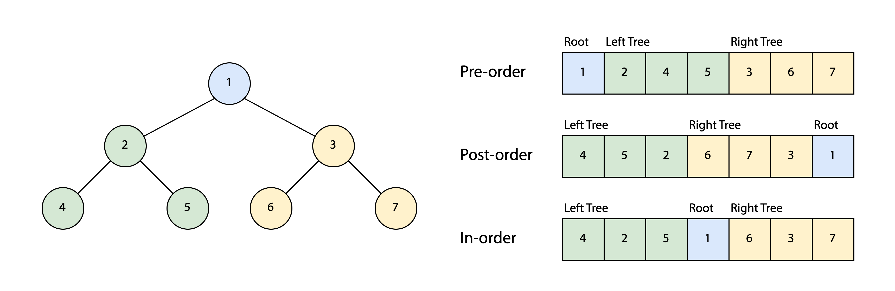

## Depth First Search



트리 순회에서 가장 자주 사용되는 방식은 DFS이다. 트리를 `[루트]`, `[왼쪽 서브트리]`, `[오른쪽 서브트리]`로 나누고, 왼쪽 서브트리와 오른쪽 서브트리를 다시 서브트리의 루트, 서브트리의 왼쪽 서브트리, 서브트리의 오른쪽 서브트리로 나누어서 재귀적으로 정점들을 방문한다.

**(1) 전위 순회(Pre-order)**

전위 순회는 트리의 정점들을 `[루트]` - `[왼쪽 서브트리]` - `[오른쪽 서브트리]` 순으로 방문하는 방식이다. 전위 순회에서 부모 정점은 반드시 자식 정점보다 먼저 처리되기 때문에 항상 [[위상 정렬|위상적으로 정렬]]되어 있다.[^1]

```text
procedure preorder(node)
    if node = null
        return
    visit(node)
    preorder(node.left)
    preorder(node.right)
```

**(2) 후위 순회(Post-order)**

후위 순회는 트리의 정점들을 `[왼쪽 서브트리]` - `[오른쪽 서브트리]` - `[루트]` 순으로 방문하는 방식이다.

```text
procedure postorder(node)
    if node = null
        return
    postorder(node.left)
    postorder(node.right)
    visit(node)
```

**(3) 중위 순회(In-order)**

후위 순회는 트리의 정점들을 `[왼쪽 서브트리]` - `[루트]` - `[오른쪽 서브트리]` 순으로 방문하는 방식이다. 중위 순회는 이진 탐색 트리(BST)에서 키 값을 오름차순으로 가져올 때 사용할 수 있다.

```text
procedure inorder(node)
    if node = null
        return
    inorder(node.left)
    visit(node)
    inorder(node.right)
```


[^1]: ["Tree traversal", *Wikipedia*.](https://en.wikipedia.org/wiki/Tree_traversal)
