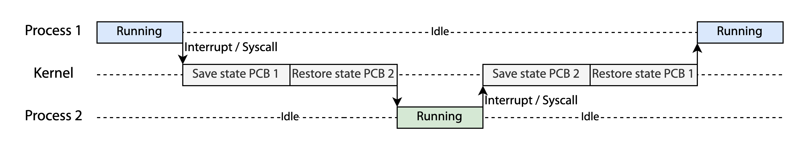
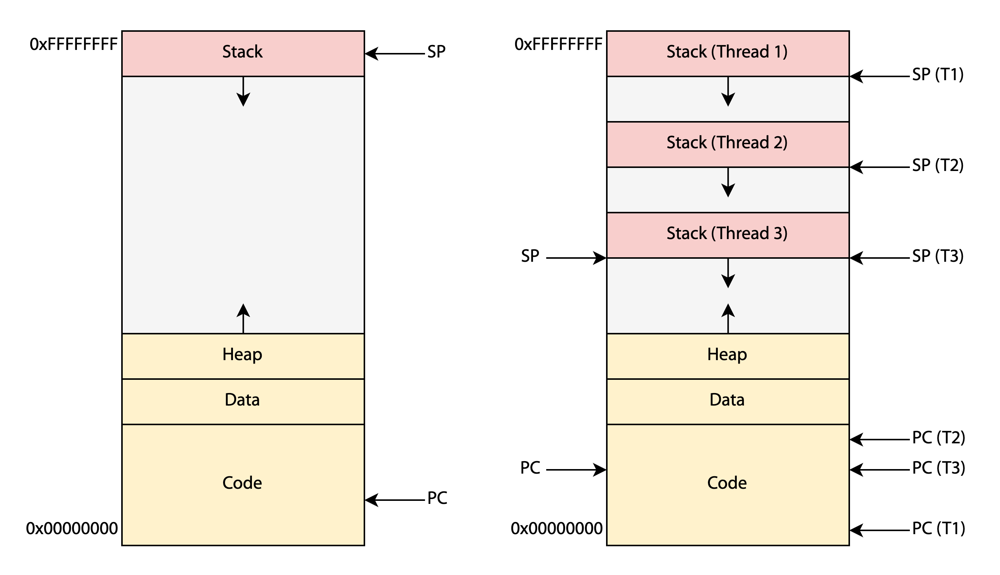

## 컨텍스트
**(1) 컨텍스트**

컨텍스트(context)는 프로세스 혹은 [[쓰레드]]의 현재 상태를 나타내며, CPU 레지스터 값, 프로세스의 상태, 메모리 관리 정보 등을 포함한다.[^1] 컨텍스트는 프로세스의 [[프로세스와 PCB|PCB]]에 포함되어 있고, 운영체제는 프로세스 혹은 쓰레드를 실행할 때 PCB에서 컨텍스트 정보를 읽어온다.

**(2) 유저 모드에서 커널 모드로**

인터럽트, 트랩, 시스템 콜이 발생하면 운영체제는 현재 프로세스의 실행을 중단하고 유저 모드에서 커널 모드로 전환하게 된다. 이떼, 커널은 프로세스의 컨텍스트를 PCB에 저장해 놓는다(state save). 이후 다시 유저 모드로 전환되어 프로세스를 재개할 때, PCB에 저장된 컨텍스트를 복원한다(state restore).

## 컨텍스트 스위치

**(1) 컨텍스트 스위치**

컨텍스트 스위치(context switch)는 CPU 코어에서 실행하는 프로세스/쓰레드를 다른 프로세스/쓰레드로 전환하는 작업이다. 컨텍스트 스위치가 발생하면 커널은 현재 실행 중인 프로세스/쓰레드의 컨텍스트를 PCB에 저장하고(state save), 다음 실행할 프로세스/쓰레드의 컨텍스트를 불러온다(state restore).

컨텍스트가 전환되는 동안 시스템에서는 아무런 유저 프로세스도 실행되지 않는다.

**(2) 하드웨어 지원**

컨텍스트 스위치가 완료되기까지 걸리는 시간은 하드웨어 환경에 따라 달라질 수 있다. 예를 들어 프로세서가 여러 개의 레지스터 세트를 제공한다면 레지스터 값 변경에 걸리는 시간을 단축할 수 있다.[^2]

## 프로세스와 쓰레드 스위치

**(1) 공통점**

프로세스와 쓰레드 모두 컨텍스트 스위치 시 레지스터와 스택 포인터, 프로그램 카운터를 바꿔줘야 한다.

**(2) 차이점**

프로세스들은 독립된 메모리 공간을 가지고 있기 때문에 프로세스가 스위치될 때 가상 메모리 공간과 관련된 작업들을 수행해야 한다. 그래서 새 프로세스에 맞게 페이지 테이블을 갱신하고 [[TLB]] 캐시를 비우게 된다.

반면 같은 프로세스에 속하는 쓰레드들은 가상 메모리 공간을 공유한다. 따라서 페이지 테이블을 변경할 필요가 없으며 TLB 캐시도 그대로 유지할 수 있다. 이로 인해 프로세스 스위칭에 비해 스위칭 비용을 줄일 수 있다.[^3][^4]

[^1]: A. Silberschatz, P. B. Galvin, and G. Gagne, "Process" in*Operating system concepts*, 10th ed., Hoboken, N.J: Wiley, 2018, pp. 114-115
[^2]: "Lecture 3: Processes", *CSI 3101: 운영체제*, 2023.
[^3]: [“Thread context switch Vs. process context switch,” *Stack Overflow*, 2011.](https://stackoverflow.com/questions/5440128/thread-context-switch-vs-process-context-switch)
[^4]: [ByteByteGo, “FANG Interview Question | Process vs Thread,” *YouTube*, 2022.](https://www.youtube.com/watch?v=4rLW7zg21gI)