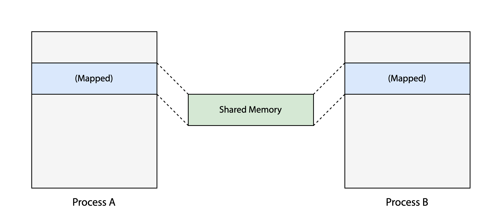
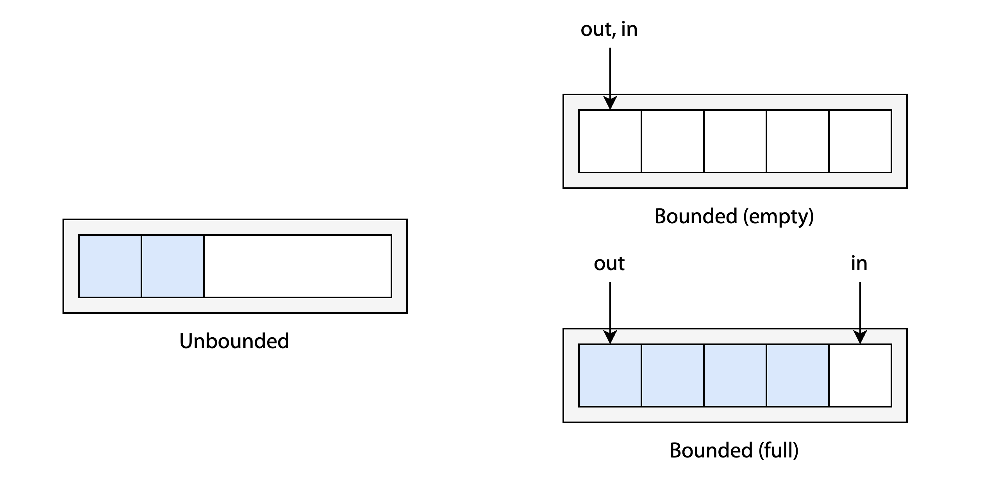
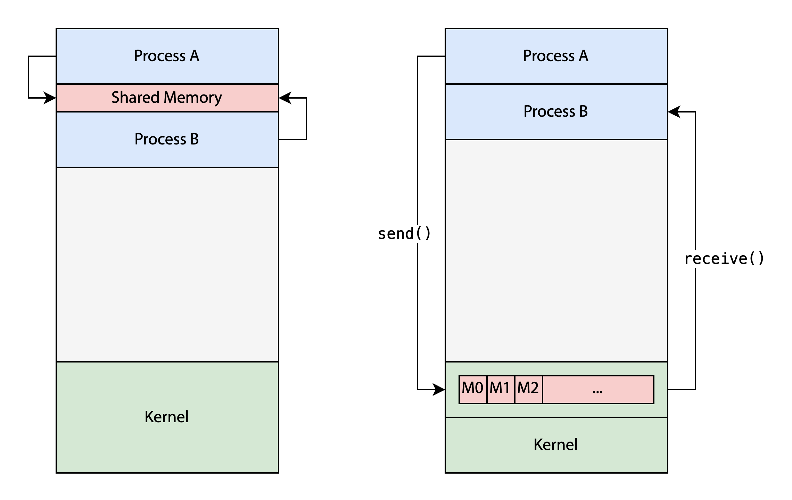
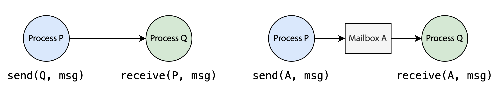
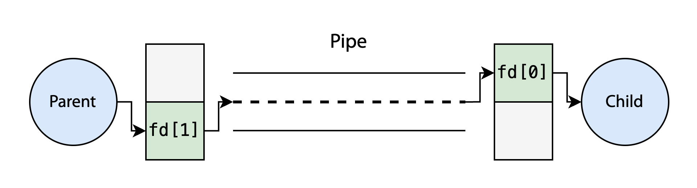

## IPC

### 협력 프로세스

프로세스는 독립적으로 실행될 수 있지만 정보 공유, 계산 속도 향상, 그리고 모듈성을 위해 여러 프로세스가 협력하여 실행될 수도 있다. 프로세스가 협력하기 위해서는 서로 데이터를 주고 받을 수 있어야 한다. 프로세스 간 통신(IPC)은 협력하는 [[프로세스와 PCB|프로세스]]들이 서로의 동작을 동기화하기 위한 메커니즘을 제공한다.

### IPC 모델

IPC에는 크게 (1) 공유 메모리 모델과 (2) 메세지 전달 모델이 있다. 공유 메모리 모델은 속도가 빠르고 커널의 개입이 적어 대용량 데이터 전송에 적합하지만 같은 머신 안에 있는 프로세스끼리만 가능하다. 반면 메세지 전송 모델은 구현이 쉽지만 커널의 개입이 크기 때문에 상대적으로 속도가 느리다.

## 공유 메모리 모델

### 프로세스 내 메모리 공간을 공유

협력하는 프로세스들이 서로 통신할 수 있는 방법 중 하나는 메모리 상의 공유 영역(region)을 사용하는 것이다. 프로세스들은 공유 메모리 블록을 자신의 프로세스 주소 공간에 매핑하고, 매핑된 블록에 값을 읽고 쓰면서 다른 프로세스와 데이터를 주고 받는다. 이러한 특징 때문에 공유 메모리 방식은 동일한 머신의 프로세스 간에만 사용할 수 있다는 제약이 있다.

공유 메모리를 사용하는 방식은 커널 의존성이 낮고 IPC 수단 중에서 가장 빠른 편에 속한다. 프로세스들은 공유 메모리를 마치 자신의 프로세스 메모리 공간처럼 접근할 수 있고, 시스템 콜도 초기에 공유 메모리를 설정할 때에만 호출된다. 또한 주고받을 데이터의 형식과 위치는 전적으로 프로세스에 의해 결정되며 커널과는 무관하다.[^1]

프로세스의 메모리 공간은 격리되어 있기 때문에 원래는 다른 프로세스가 접근할 수 없지만, 공유 메모리로 지정한 영역은 프로세스 간의 합의 하에 이러한 제한 없이 자유롭게 값을 읽고 쓰는 것이 허용된다. 하지만 그렇기 때문에 동기화 문제에 대한 고려가 필요하다.

### 버퍼를 통한 접근

공유 메모리 방식에서는 버퍼를 사용한다. 프로듀서 프로세스는 버퍼에 값을 쓰고 컨슈머 프로세스는 버퍼의 값을 비우는 형태로 동작한다. 버퍼의 크기는 무한하게 설정(unbounded)할 수도, 유한하게 설정(bounded)할 수도 있다.

**(1) Unbounded buffer**

실질적으로 버퍼의 크기가 무제한인 경우이다. 컨슈머는 버퍼에 값이 들어올 때까지 기다려야 하지만 프로듀서는 제한없이 무한정으로 버퍼에 새 값을 채워넣을 수 있다.

**(2) Bounded buffer**

고정된 크기의 버퍼를 사용하는 방식이다. 버퍼가 가득 차있을 경우 프로듀서는 빈 공간이 생길 때까지 대기해야 한다. 일반적으로 circular array로 구현하며, 버퍼의 빈 공간을 가리키는 `in` 포인터와 값을 읽을 위치를 가리키는 `out` 포인터를 사용한다.

포인터의 위치는 버퍼의 상태를 나타내는 데에 사용된다. `in == out`이면 버퍼가 비어있음(컨슈머 대기)을 의미하고, `(in + 1) % BUFFER_SIZE == out`이면 버퍼가 가득 차있음(프로듀서 대기)을 의미한다.

이런 방식을 사용하면 실질적으로 활용할 수 있는 버퍼의 갯수는 `BUFFER_SIZE - 1`이다.[^2] 만약 버퍼를 모두 채우려고 하면 `in == out`이 되는데, 이러면 버퍼가 비어있는 상태와 가득 찬 상태를 구분할 수 없게 된다. 데이터의 갯수를 세는 카운터 변수를 도입하여 이를 해결할 수 있지만 카운터 변수를 두지 않는다면 버퍼의 마지막 한 칸은 비워두어야 한다.

## 메세지 전달 모델

### 커널을 경유하기

또다른 방식은 프로세스들이 직접 데이터를 주고 받지 않고 커널을 통해서 메세지를 주고 받아 통신하는 것이다. 메세지를 주고 받기 위해서는 통신하는 프로세스들 사이에 링크(communication link)가 존재해야 한다. 이 링크를 물리적으로 구현하는 방식에는 여러 가지가 있을 수 있지만 여기서는 논리적인 구현에 집중한다.

메세지 전달은 메세지를 보내는 작업(`send`)과 메세지를 받는 작업(`receive`)으로 구성되는데 두 작업 모두 시스템 콜을 호출한다.[^3] 그래서 공유 메모리 방식에 비해 상대적으로 비용이 크고 속도가 느리다.

### 네이밍: 직접 통신과 간접 통신

**(1) 직접 통신(direct communication)**

프로세스 P에서 Q로 메세지를 직접 전달하는 방식이다. 프로세스 P는 `send()`의 파라미터에 Q를 직접 명시한다. 모든 프로세스 (P, Q)에 대해 P와 Q를 연결하는 링크가 반드시 유일하게 존재하고, 각 링크의 양 끝단에는 오직 P와 Q만 존재한다.

하지만 이와 같은 방식에서는 모듈성이 저하된다. 특정 프로세스(Q)의 식별자(identifier)가 바뀌면 그 프로세스를 참조하는 다른 모든 프로세스(P)들을 찾아서 변경된 식별자를 반영해줘야 하기 때문이다. 그래서 프로세스를 직접 참조하는 상황을 우회하기 위해 간접 통신을 사용한다.

**(2) 간접 통신(indirect communication)**

프로세스 P에서 Q로 메세지를 직접 전달하는 대신 "메일박스"라는 매개체를 통해서 메세지를 전달하는 방식이다. 이 방식에서 프로세스 P는 메일박스 A로 메세지를 전송하고, 프로세스 Q는 메일박스로부터 메세지를 가져온다. 즉 P와 Q는 `send()`와 `receive()`의 파라미터로 서로의 식별자 대신 메일박스 A의 식별자를 명시한다. 

간접 통신에서는 직접 통신에서와 다르게 여러 개의 프로세스가 하나의 링크(메일박스)를 공유할 수도 있다. 그리고 메일박스를 공유하는 모든 프로세스 사이에는 링크가 생긴다. 이런 케이스에서 어떤 프로세스가 메일박스에 도착한 메세지를 읽도록 할 건지는 선택에 달렸다. 한 번에 하나의 프로세스만 `receive()`를 수행하도록 할 수도 있고, 라운드 로빈으로 서로 돌아가면서 메세지를 읽도록 할 수도 있다.[^4]

### 동기화

송신(`send`)과 수신(`receive`)는 각각 동기(blocking, synchronous) 혹은 비동기(nonblocking, asynchronous)로 구현할 수 있다.

||송신|수신|
|-|-|-|
|동기|상대가 메세지를 받을 때까지 block된다.|누군가가 자신에게 메세지를 보낼 때까지 block된다.|
|비동기|메세지를 보내고 바로 다음 작업을 이어나간다.|메세지가 있으면 받고 없으면 null을 받는다.|

### 버퍼링

직접 통신이든 간접 통신이든 링크를 통해 전달되는 메세지는 전달 큐(temporal queue)에 보관된다. 큐의 크기에 대한 선택은 아래와 같이 3가지가 있다.

- **Zero Capacity**: 큐의 크기가 0인 케이스. 메세지를 보관할 수 없기 때문에 동기(blocking) 방식의 `send`만 가능하다.
- **Bounded Capacity**: 큐의 크기가 유한하게 정해져 있는 케이스. 큐가 가득 차있지 않으면 논블로킹 `send`가 가능하지만 꽉 차있다면 블로킹되어야 한다.
- **Unbounded Capacity**: 무한하게 메세지를 보낼 수 있기 때문에 송신 측은 블락되지 않는다.

## IPC 시스템 사례

### 파이프

파이프는 메세지 전달 모델 IPC로 초창기 UNIX 시스템의 기본적인 IPC 메커니즘 중 하나로, 파일 디스크립터(file descriptor)를 통해 데이터를 읽고 쓰는 방식이다. 파이프는 기본적으로 단방향(unidirectional)으로, 한쪽 끝(write end)에 데이터를 쓰면 다른 쪽 끝(read end)에서 이를 읽는 형태로 구현된다. 데이터를 쓰는 쪽에서는 read end를 막아두고 읽는 쪽에서는 write end를 막아둔다.

**파이프**(ordinary pipe)는 그것을 생성한 프로세스와 자식 프로세스들만 접근할 수 있다는 특징이 있다. 특정 프로세스에 종속되어 있기 때문에 프로세스가 종료되면 파이프도 같이 사라지게 된다. 이에 대한 해답은 **이름이 있는 파이프**(named pipe, UNIX에서는 FIFO)이다. 이름이 있는 파이프에서는 관련이 없는 프로세스들도 데이터를 주고 받을 수 있고 프로세스가 종료된 이후에도 파이프가 그대로 남아있는다.

### 소켓

네트워크를 통해 통신하는 프로세스들은 소켓을 사용한다. 소켓은 IP 주소와 포트 번호로 식별된다. 일반적으로 소켓 통신은 서버-클라이언트 형태를 띄며 양방향으로 데이터를 주고 받을 수 있다. 하나의 프로세스는 여러 개의 포트를 사용할 수 있지만 하나의 포트가 여러 개의 프로세스에 의해 공유되는 것은 불가능하다.

### RPC

RPC는 원격에 있는 프로시저를 마치 로컬의 프로시저처럼 실행할 수 있도록 해주는 메세지 전달 시스템이다. RPC 시스템에서 클라이언트는 불필요한 디테일은 숨기고 최소한의 정보만 stub를 통해 전달하여 프로시저를 호출한다. 이 때 통신 과정에서 해결해야 하는 문제가 두 가지가 있는데, 하나는 메세지가 정확히 한번(exactly once) 처리해야 하는 것이고 다른 하나는 클라이언트가 원격 프로시저의 위치를 식별하는 것이다.

우선 메세지를 정확히 한번 처리하기 위해 서버는 최대 한번(at-most-once) 프로토콜을 구현하고, 여기에 추가적으로 프로시저의 실행 여부를 알려주는 ACK 메세지를 클라이언트에게 전송한다. 또한 운영 체제는 고정된 RPC 포트에서 랑데부 데몬(matchmaker) 서비스를 제공하여 클라이언트에게 원격 프로시저의 호출 정보를 공유해준다.

[^1]: A. Silberschatz, P. B. Galvin, and G. Gagne, "Process" in *Operating system concepts*, 10th ed., Hoboken, N.J: Wiley, 2018, pp. 125.
[^2]: Silberschatz et al., pp. 126.
[^3]: [“3.2. IPC Models — Computer Systems Fundamentals,” *w3.cs.jmu.edu*.](https://w3.cs.jmu.edu/kirkpams/OpenCSF/Books/csf/html/IPCModels.html)
[^4]: Silberschatz et al., pp. 130.