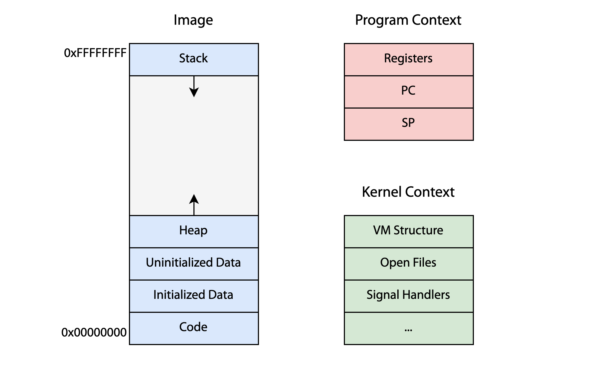
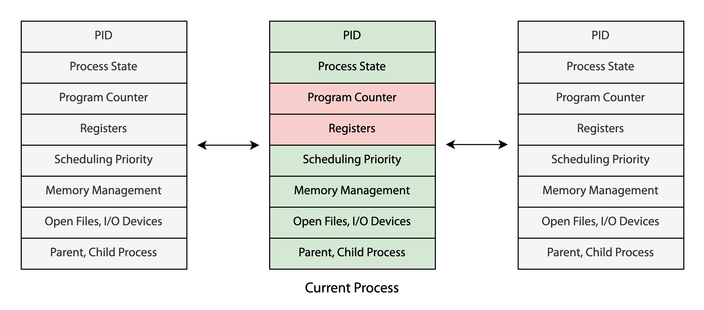

## 프로세스
**(1) 프로세스란**

프로세스는 실행 중인 프로그램의 인스턴스를 나타낸다. OS는 프로세스를 실행하기 위해 리소스를 할당하고, 실행에 필요한 여러 정보들을 관리한다. 프로세스는 이미지(image)와 컨텍스트(context)로 구성되어 있다.[^1]

**(2) 이미지(image)**

프로세스의 이미지는 실행 중인 프로그램의 메모리 구성을 나타낸다. 이미지는 `코드`, `데이터`, `힙`, `스택`으로 이루어져 있다. 

- `코드`: 프로그램의 명령어(instruction). 주로 읽기 전용(read-only).
- `데이터`: 프로그램의 전역, 정적 변수들. 초기화된 변수들이 낮은 주소, 초기화되지 않는 변수들이 높은 주소.
- `힙`: 런타임에 동적으로 할당되는 메모리. 낮은 주소부터 높은 주소로 늘어남.
- `스택`: 함수 호출 시 생성되는 지역 변수와 리턴 주소를 저장. 높은 주소에서 낮은 주소로 늘어나며 함수 호출이 종료되면 스택 프레임이 제거됨.

32비트 머신 위에서 프로세스는 4GB의 메모리 주소 공간을 부여받게 되는데, 4GB 주소 공간의 낮은 주소부터 코드, 데이터, 힙을, 반대로 높은 주소부터 스택을 할당한다.

**(3) 컨텍스트(context)**

컨텍스트는 운영 체제가 프로세스의 실행을 중단하거나 재개하기 위해 필요한 정보들이다. 프로세스의 user-space 상태와 관련된 `프로그램 컨텍스트`, kernel-space 상태와 관련된 `커널 컨텍스트`로 이루어져 있다.

- `프로그램 컨텍스트`: 프로그램 카운터(PC), 스택 포인터(SP), 데이터 레지스터 등 CPU가 프로그램 실행에 필요로 하는 정보들.
- `커널 컨텍스트`: PID, 우선 순위, 열린 파일 목록, 시그널 등 커널이 프로세스를 관리하는 데 필요로 하는 정보들.

## 프로세스 제어 블록(Process Control Block)

**(1) 커널 자료구조**

프로세스의 이미지와 컨텍스트에 대한 정보는 커널 자료구조인 프로세스 제어 블록(PCB)에 저장된다. 모든 프로세스는 고유한 PCB를 가지며, 운영체제는 이를 기반으로 프로세스를 제어한다. 운영체제는 PCB에 기록된 정보를 참고하여 [[프로세스 스케줄링]], [[컨텍스트 스위칭]]과 같은 작업을 수행한다.

**(2) 리눅스의 PCB**

[[리눅스 태스크|리눅스의 프로세스]]는 `task_struct` 구조체로 표현되며, 리눅스 커널은 `task_struct`의 이중 리스트(doubly-linked list)로 모든 프로세스를 관리한다.[^2] 커널은 `current` 포인터를 통해 현재 실행 중인 프로세스의 PCB에 접근한다.

[^1]: "Lecture 3: Processes", *CSI 3101: 운영체제*, 2023.
[^2]: A. Silberschatz, P. B. Galvin, and G. Gagne, "Process" in*Operating system concepts*, 10th ed., Hoboken, N.J: Wiley, 2018, pp. 111