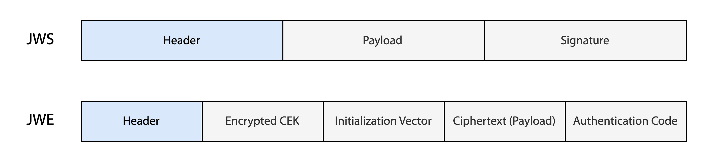

## 목적

### JWT 개요

```
eyJhbGciOiJIUzI1NiIsInR5cCI6IkpXVCJ9.
eyJzdWIiOiIxMjM0NTY3ODkwIiwiaWF0IjoxNTE2MjM5MDIyfQ.
j9agH1qsjVlohO10oie8Wv37y-v68PCprfqB3YTEInM
```

JWT는 데이터를 간결하고(compact) 안전하게 전달하기 위한 수단이다. Base64로 인코딩된 문자열의 형태를 가지며 `.` 문자로 구분되는 여러 개의 파트로 이루어져 있다. 각 파트는 헤더, 페이로드, 서명 혹은 암호화 관련된 내용을 나타낸다. URL-Safe하기 때문에 쿼리 파라미터나 HTTP Authorization 헤더에서 자주 사용된다.

### 클레임 셋

```
{
  "sub": "1234567890",
  "name": "John Doe",
  "admin": true,
  "iat": 1516239022
}
```

JWT를 통해 전달하고자 하는 데이터를 "클레임(claim)"이라고 한다. 클레임은 키-값 페어로 이루어져 있으며 여러 개의 키-값 페어로 구성된 JSON을 "클레임 셋(claims set)"이라고 한다. 또한 키-값 페어에서 키를 "클레임 이름(name)"이라고 하며 클레임 셋 안에서 중복되지 않아야 한다.

### JWS와 JWE

> *The claims in a JWT are encoded as a JSON object that is used as the payload of a JSON Web Signature (JWS) structure or as the plaintext of a JSON Web Encryption (JWE) structure...*[^1]

JWT에서는 클레임을 안전하게 전달하기 위해 디지털 서명 혹은 암호화를 한다. 서명을 하는 방식을 **JWS**(JSON Web Signature), 암호화하는 방식을 **JWE**(JSON Web Encryption)이라고 하며 JWT는 반드시 JWS, JWE 둘 중 하나로 표현되어야 한다. [JWT 디버거](https://jwt.io)에서 사용하는 JWT도 JWS 형태의 토큰이다.

```
eyJhbGciOiJIUzI1NiIsInR5cCI6IkpXVCJ9.               ← 헤더
eyJzdWIiOiIxMjM0NTY3ODkwIiwiaWF0IjoxNTE2MjM5MDIyfQ. ← 페이로드 (클레임)
j9agH1qsjVlohO10oie8Wv37y-v68PCprfqB3YTEInM         ← 서명
```

JWS에서 클레임 셋은 페이로드(payload)로 사용된다. 디지털 서명 방식은 클레임을 평문으로 전송하기 때문에 누구나 값을 읽을 수 있다. 하지만 서명된 시그니처로 위변조 여부를 검증하기 때문에 데이터의 무결성을 보장한다.

```
eyJhbGciOiJSU0EtT0FFUCIsImVuYyI6IkExMjhHQ00ifQ. ← 헤더
OKOawDo13gRp2ojaHV7LFpPqKfYBlYI3E5FZ2zZzq7Y.    ← 암호화된 키
48V1_ALb6US04U3b.                               ← 초기화 벡터 (IV)
5eym8TW_c8SuK0ltJ3rpYIzOeDQz7VWvKqgGWpYgJ8w.    ← 암호화된 페이로드 (클레임)
XFBoMYUZodetZdvTiFvSkQ                          ← 인증 태그
```

반면 JWE에서 클레임 셋은 암호화된 페이로드의 plaintext로 사용된다. 암호화 방식은 클레임 자체를 암호화하여 전송하기 때문에 복호화가 가능한 사용자만 값을 읽을 수 있다. 따라서 기밀성을 보장한다.

## 구성 요소

### JOSE 헤더



```
{
  "typ":"JWT",
  "alg":"HS256"
}
```

헤더에는 JWT의 속성과 암호화 기법에 대한 정보가 담겨있다. 

|필드|내용|
|-|-|
|**`typ`**|JWT와 JWT가 아닌 데이터가 혼용되는 환경에서 데이터가 JWT임을 나타내기 위해 사용되며 값은 `"JWT"`로 설정한다. 값 자체는 case-insensitive하지만 레거시 시스템과의 호환성을 위해 대문자를 사용하는 것이 권장된다. JWT만 사용되는 환경에서는 생략해도 무방하다.|
|**`cty`**|JWT 안에 또다른 JWT가 포함된 중첩된 구조일 경우 이를 나타내기 위해 사용되는 파라미터로 일반적인 상황에서는 제외하는 것이 권장된다.|
|**`alg`**|서명(JWS)이나 키 암호화(JWE) 사용된 알고리즘을 나타낸다. 서명이나 암호화 알고리즘이 없는 보호되지 않은 JWT(Unsecured JWT)도 있는데, 이 경우 `"alg"`를 `"none"`으로 설정하며 이 때의 JWT는 시그니처가 생략된 JWS의 형태를 띈다.|
|**`enc`**|페이로드 암호화(JWE)에 사용된 알고리즘을 나타낸다. JWE에만 포함된다.

> *An Unsecured JWT is a JWS using the "alg" Header Parameter value "none" and with the empty string for its JWS Signature value, as defined in the JWA specification.*[^1]

### 페이로드(클레임)


JSON 페이로드에 포함될 클레임들은 자유롭게 정할 수 있다. 다만 반드시 중복된 클레임 이름이 포함되지 않도록 해야 한다. 클레임 이름은 크게 Registered, Public, Private로 분류할수 있다.

**(1) Registered**

스펙에 정의된 표준 클레임이다. 의무적인 사항이 전혀 없지만 상호운용성을 위해 사용될 수 있다. 아래는 등록된 클레임 이름의 일부이며 전체 목록은 [IANA JWT 클레임 레지스트리](https://www.iana.org/assignments/jwt/jwt.xhtml)에서 확인할 수 있다.

|필드|내용|
|-|-|
|**`iss`**|JWT를 발행한 주체를 나타낸다.|
|**`sub`**|JWT가 무엇에 대한 정보를 담고있는 지를 나타낸다. (e.g. 유저 ID)|
|**`aud`**|수신자를 나타낸다.|
|**`exp`**|만료 시점을 나타낸다. 만료 시점 이후에는 해당 JWT가 거부되어야 한다.|
|**`nbf`**|`exp`의 반대 개념으로 명시된 시점 이전에는 해당 JWT가 거부되어야 한다.|
|**`iat`**|JWT가 발행된 시점을 나타낸다.|
|**`jti`**|해당 JWT의 고유한 식별자를 나타내며 JWT 재사용 여부를 판단하는 데에 사용할수 있다.|

**(2) Public**

```
{
  "http://example.com/is_root": true, // Public Name
  "roles": ["ADMIN"]                  // Private Name
}
```

등록된 클레임 이름 외에도 사용자가 자유롭게 클레임 이름을 지정할 수 있다. 그 중 Public은 충돌 가능성이 낮은 이름(Collision-Resistant Name)을 사용한다. Collision-Resistant Name에는 도메인 네임, UUID 등이 있다. 

> *Examples of collision-resistant namespaces include: Domain Names, Object Identifiers (OIDs) as defined in the ITU-T X.660 and X.670 Recommendation series, and Universally Unique IDentifiers (UUIDs) [RFC4122].*[^1]

**(3) Private**

Registered, Public이 아닌 클레임은 Private이다. 생산자와 소비자의 합의 하에 사용되며 충돌 가능성이 있기 때문에 사용에 주의해야 한다.

### 시그니처와 인증 태그


JWS에는 헤더와 페이로드를 시크릿 키로 암호화한 값을 Base64로 인코딩하여 시그니처로 사용한다. 오직 키를 가지고 있는 주체만 서명을 생성하거나 확인할 수 있기 때문에 데이터 위변조 여부를 확인하고 무결성을 검증할 수 있다. 유사하게 JWE에도 암호화된 내용의 변조를 방지하는 인증 코드가 있다. 이 인증 코드는 평문의 페이로드를 CEK(암호화 키) + IV로 암호화하는 과정에서 같이 생성된다.

## 생성과 검증

### JWS 방식의 생성과 검증

**(1) JWS 생성**

```
BASE64URL(UTF8(JWS Protected Header)). ← [1]
BASE64URL(JWS Payload).                ← [2]
BASE64URL(JWS Signature)               ← [3]
```

- **[1]**: JOSE 헤더를 Base64로 인코딩한다.
- **[2]**: 페이로드에 담길 내용을 Base64로 인코딩한다.
- **[3]**: [1]과 [2]를 합친 `ASCII([1]||'.'||[2])`를 사용하여 시그니처를 생성한 후 Base64로 인코딩한다.

**(2) JWS 검증**

인코딩된 시그니처([3])를 Base64로 디코딩 한 다음 이 값이 `ASCII([1]||'.'||[2])`에 알고리즘을 돌린 결과와 일치하는 지를 확인하여 무결성을 검증한다.

### JWE 방식의 생성과 검증

**(1) JWE 생성**

```
BASE64URL(UTF8(JWE Protected Header)).    ← [1]
BASE64URL(JWE Encrypted Key).             ← [2]
BASE64URL(Initialization Vector).         ← [3]
BASE64URL(Ciphertext).                    ← [4]
BASE64URL(Authentication Tag)             ← [5]
```

- **[1]**: JOSE 헤더를 Base64로 인코딩한다.
- **[2]**: 키 합의 방식에 따라 암호화된 CEK 혹은 빈 문자열을 Base64로 인코딩한다.
- **[3]**: 암호화 알고리즘에 따라 랜덤하게 IV를 생성한 후 Base64로 인코딩한다.
- **[4]**: CEK + IV + AAD로 암호화된 암호문(ciphertext)를 Base64로 인코딩한다.
- **[5]**: 암호문을 기반으로 인증 태그(무결성 검증)를 생성하고 Base64로 인코딩한다.

**(2) JWE 검증**

디코딩 및 복호화 후 인증 태그를 활용하여 무결성을 검증한다.


[^1]: [M. Jones, J. Bradley, N. Sakiumra, "JSON Web Token (JWT)," RFC 7519, 2015.](https://datatracker.ietf.org/doc/html/rfc7519)